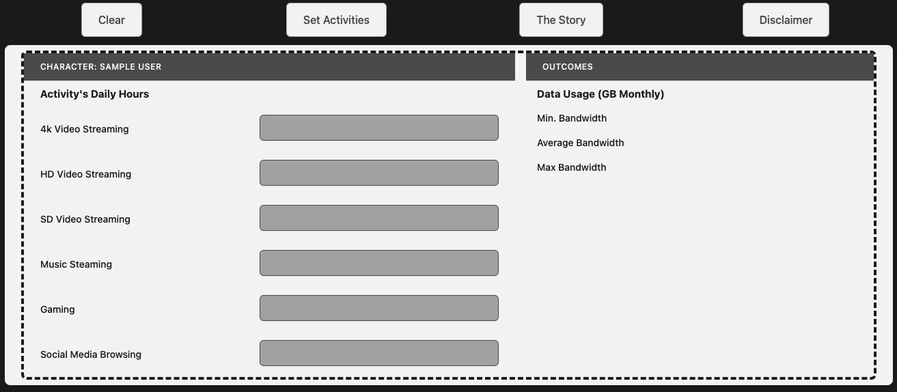

## About ELTsim
A test run & use case of [EvoELT](https://github.com/kennyokeke/EvoELT). 

ELTsim is a Sims-inspired tool designed to optimize character activities through AI-powered insights and data-driven recommendations. By integrating with EvoELT, ELTsim tracks activity schedules, metrics, and patterns over time to reveal how actions affect key character traits like happiness, energy, and relationships. It provides real-time analysis to help players make informed decisions and maximize outcomes for their virtual characters.

### Frontend

### Structure
ELTsim combines a Vue.js-based frontend with a backend powered by JavaScript and Python. EvoELT serves as the backbone, processing raw event data and providing processed insights.

- `fe-vuejs_frontend` frontend interface for setting character activities and viewing recommendations
- `fe-javascript_expressjs_backend` backend for activity management
- `util-python_message_queueing` integration with EvoELT via message queuing

### How to run
1. Dockerize EvoELT
2. Instructions from READMEs in each project folder
3. Load the UI to set character activities and view estimations
4. Track character metrics over time through the system
5. Use insights to optimize character activities for better outcomes
